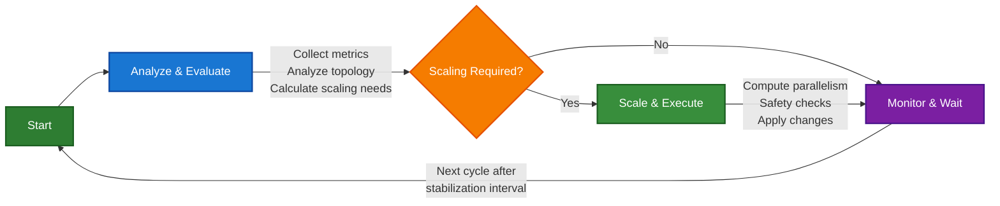

# Flink Autoscaler

The Flink Autoscaler is a sophisticated component that automatically adjusts the parallelism of Apache Flink jobs based on real-time performance metrics. It implements intelligent scaling algorithms to optimize resource utilization while maintaining job performance and stability.

## Overview

The autoscaler continuously monitors Flink job metrics and makes data-driven decisions to scale job vertices up or down. It aims to maintain optimal resource utilization (typically around 70% by default) while respecting constraints like maximum parallelism, scaling intervals, and stability periods.

**Key Features:**
- **Automatic Parallelism Adjustment**: Dynamically scales job vertices based on load, throughput, and resource utilization
- **Memory Optimization**: Intelligent memory tuning to prevent out-of-memory issues and optimize resource allocation
- **Topology-Aware Scaling**: Understands job topology and data flow patterns for optimal scaling decisions
- **Configurable Policies**: Extensive configuration options for fine-tuning scaling behavior
- **State Management**: Persistent tracking of scaling history and metrics for informed decisions
- **Event-Driven Architecture**: Pluggable event handling for monitoring and alerting

## Architecture

### Core Components

#### 1. JobAutoScaler Interface
The main entry point with two primary operations:
- `scale(Context context)`: Compute and apply new parallelism overrides
- `cleanup(Context context)`: Clean up resources when job is deleted

#### 2. JobAutoScalerImpl
The default implementation orchestrating the entire scaling process:

```java
public class JobAutoScalerImpl<KEY, Context extends JobAutoScalerContext<KEY>>
        implements JobAutoScaler<KEY, Context>
```

**Key Dependencies:**
- `ScalingMetricCollector`: Collects metrics from Flink job
- `ScalingMetricEvaluator`: Evaluates metrics and determines scaling needs
- `ScalingExecutor`: Executes scaling decisions with safety checks
- `AutoScalerEventHandler`: Handles scaling events and notifications
- `ScalingRealizer`: Applies scaling changes to the actual job
- `AutoScalerStateStore`: Persists scaling state and history

#### 3. Metrics Collection and Evaluation

**ScalingMetricCollector** (`flink-autoscaler/src/main/java/org/apache/flink/autoscaler/ScalingMetricCollector.java:1`)
- Collects metrics from Flink REST API
- Aggregates metrics across subtasks and time windows
- Handles metric validation and filtering

**Key Metrics Tracked:**
- `LOAD`: Subtask busy time ratio (0=idle, 1=fully utilized)
- `TRUE_PROCESSING_RATE`: Processing rate at full capacity (records/sec)
- `TARGET_DATA_RATE`: Target processing rate derived from inputs
- `LAG`: Total number of pending records
- `PARALLELISM`: Current job vertex parallelism
- `GC_PRESSURE`: Garbage collection pressure metrics
- `HEAP_MEMORY_USED`: JVM heap memory utilization
- `MANAGED_MEMORY_USED`: Flink managed memory utilization

**ScalingMetricEvaluator** (`flink-autoscaler/src/main/java/org/apache/flink/autoscaler/ScalingMetricEvaluator.java:1`)
- Analyzes collected metrics to determine scaling needs
- Calculates target parallelism based on utilization targets
- Considers scaling constraints and stability requirements

#### 4. Scaling Decision Logic

**JobVertexScaler** (`flink-autoscaler/src/main/java/org/apache/flink/autoscaler/JobVertexScaler.java:1`)
The core scaling algorithm component that:
- Computes optimal parallelism for each job vertex
- Considers topology constraints (e.g., key groups, partitions)
- Applies scaling factors and limits
- Handles ineffective scaling detection

**Scaling Algorithm:**
1. **Load-Based Scaling**: Primary scaling factor based on CPU utilization
2. **Throughput-Based Scaling**: Considers processing rates and backlogs
3. **Memory-Based Scaling**: Prevents memory pressure issues
4. **Topology Constraints**: Respects key group and partition limitations

#### 5. Topology Analysis

**JobTopology** (`flink-autoscaler/src/main/java/org/apache/flink/autoscaler/topology/JobTopology.java:1`)
- Analyzes job graph structure and data flow
- Identifies vertex relationships and dependencies
- Considers slot sharing groups and resource constraints
- Handles ship strategies (HASH, REBALANCE, etc.)

#### 6. State Management

**AutoScalerStateStore** (`flink-autoscaler/src/main/java/org/apache/flink/autoscaler/state/AutoScalerStateStore.java:1`)
Interface for persisting autoscaler state:
- Scaling history and decisions
- Collected metrics over time
- Configuration changes and tuning parameters
- Parallelism overrides and recommendations

**Default Implementation:**
- `InMemoryAutoScalerStateStore`: Memory-based storage (non-persistent)
- Pluggable design allows for persistent storage implementations

#### 7. Memory Tuning

**MemoryTuning** (`flink-autoscaler/src/main/java/org/apache/flink/autoscaler/tuning/MemoryTuning.java:1`)
Advanced memory optimization features:
- Automatic memory budget calculation
- TaskManager memory configuration optimization
- Detection and prevention of memory-related issues
- Integration with scaling decisions

### Scaling Process Flow



## Configuration

### Key Configuration Options

```java
// Enable/disable autoscaling
job.autoscaler.enabled = false

// Enable/disable scaling execution (evaluation only mode)
job.autoscaler.scaling.enabled = true

// Metrics aggregation window
job.autoscaler.metrics.window = 15min

// Stabilization period between scaling operations
job.autoscaler.stabilization.interval = 5min

// Target CPU utilization (0.0 - 1.0)
job.autoscaler.target.utilization = 0.7

// Utilization boundaries
job.autoscaler.target.utilization.boundary = 0.1

// Maximum scale up/down factors
job.autoscaler.scale-up.max-factor = 2.0
job.autoscaler.scale-down.max-factor = 0.5

// Vertex-specific parallelism limits
job.autoscaler.vertex.min-parallelism = 1
job.autoscaler.vertex.max-parallelism = 720

// Scaling intervals
job.autoscaler.scale-down.interval = 2min
job.autoscaler.scaling.event.interval = 30s
```

### Memory Tuning Configuration

```java
// Enable memory tuning
job.autoscaler.memory.tuning.enabled = false

// Memory utilization thresholds
job.autoscaler.memory.tuning.heap.utilization.threshold = 0.8
job.autoscaler.memory.tuning.managed.utilization.threshold = 0.8

// Memory scaling factors
job.autoscaler.memory.tuning.increase.ratio = 1.2
job.autoscaler.memory.tuning.decrease.ratio = 0.8
```

## Integration Points

### Event Handling
```java
public interface AutoScalerEventHandler<KEY, Context extends JobAutoScalerContext<KEY>> {
    void handleEvent(Context context, Type type, String reason, String message, Throwable cause);
}
```

### State Storage
```java
public interface AutoScalerStateStore<KEY, Context extends JobAutoScalerContext<KEY>> {
    void storeScalingHistory(Context jobContext, Map<JobVertexID, SortedMap<Instant, ScalingSummary>> scalingHistory);
    Map<JobVertexID, SortedMap<Instant, ScalingSummary>> getScalingHistory(Context jobContext);
    // ... other state operations
}
```

### Scaling Realization
```java
public interface ScalingRealizer<KEY, Context extends JobAutoScalerContext<KEY>> {
    boolean realize(Context context, Map<String, String> parallelismOverrides, ConfigChanges configChanges);
}
```

## Usage Examples

### Basic Usage with Kubernetes Operator
The autoscaler is automatically integrated with the Flink Kubernetes Operator. Enable it in your FlinkDeployment:

```yaml
apiVersion: flink.apache.org/v1beta1
kind: FlinkDeployment
metadata:
  name: my-flink-job
spec:
  flinkConfiguration:
    job.autoscaler.enabled: "true"
    job.autoscaler.target.utilization: "0.7"
    job.autoscaler.stabilization.interval: "5min"
```

### Standalone Usage
For custom orchestration frameworks:

```java
// Create autoscaler components
ScalingMetricCollector<String, MyJobContext> metricsCollector = new ScalingMetricCollector<>();
ScalingMetricEvaluator evaluator = new ScalingMetricEvaluator();
ScalingExecutor<String, MyJobContext> scalingExecutor = new ScalingExecutor<>();
AutoScalerEventHandler<String, MyJobContext> eventHandler = new LoggingEventHandler<>();
ScalingRealizer<String, MyJobContext> scalingRealizer = new MyScalingRealizer();
AutoScalerStateStore<String, MyJobContext> stateStore = new InMemoryAutoScalerStateStore<>();

// Initialize autoscaler
JobAutoScaler<String, MyJobContext> autoscaler = new JobAutoScalerImpl<>(
    metricsCollector, evaluator, scalingExecutor, eventHandler, scalingRealizer, stateStore);

// Create job context
MyJobContext context = MyJobContext.builder()
    .jobKey("my-job")
    .jobID(jobId)
    .jobStatus(JobStatus.RUNNING)
    .configuration(flinkConfig)
    .build();

// Execute scaling
autoscaler.scale(context);
```

## Monitoring and Troubleshooting

### Metrics and Events
The autoscaler generates detailed events for:
- Scaling decisions and execution
- Metric collection issues
- Configuration problems
- Resource constraint violations

### Debugging Configuration
```java
// Enable detailed logging
job.autoscaler.scaling.event.interval = 10s

// Evaluation-only mode for testing
job.autoscaler.scaling.enabled = false
```

### Common Issues
1. **Ineffective Scaling**: Autoscaler detects when scaling doesn't improve performance
2. **Resource Constraints**: Handles memory and CPU limitations gracefully
3. **Topology Limitations**: Respects key group and partition constraints
4. **Stabilization**: Prevents oscillating scaling behavior

## Related Documentation
- [FLIP-271: Autoscaling](https://cwiki.apache.org/confluence/display/FLINK/FLIP-271%3A+Autoscaling)
- [Flink Kubernetes Operator Autoscaler Documentation](../docs)
- [Standalone Autoscaler](../flink-autoscaler-standalone/README.md)

## Contributing
The autoscaler module is designed to be framework-agnostic. Contributions for new orchestration framework integrations, improved scaling algorithms, or enhanced monitoring capabilities are welcome.